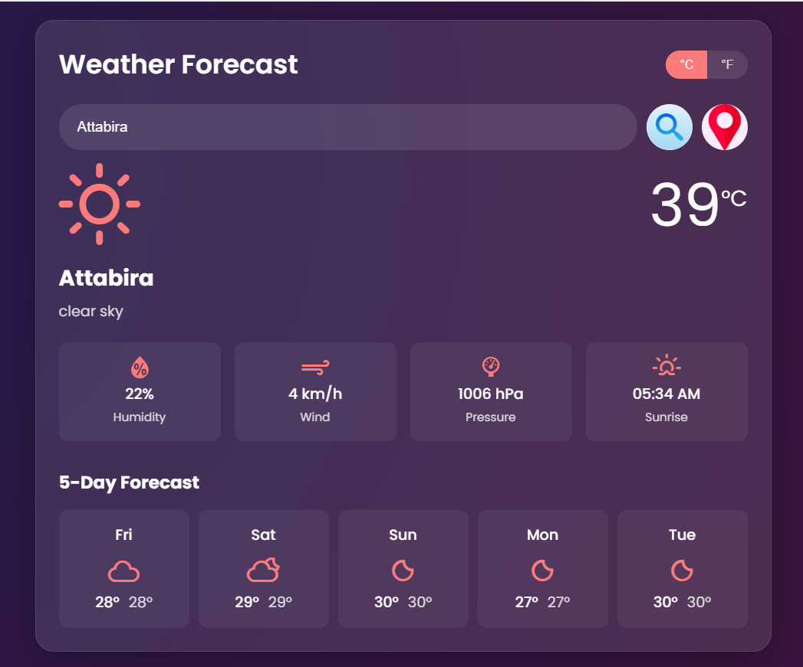

# 🌤️ Advanced Weather Forecast App

 <!-- Replace with actual screenshot file -->

A sleek, responsive weather application that provides real-time weather data and 5-day forecasts for any location worldwide.

## ✨ Features

- **Real-time Weather Data**: Current temperature, humidity, wind speed, pressure, and sunrise/sunset times
- **5-Day Forecast**: Daily weather predictions with visual icons
- **Intuitive UI**: Clean, modern interface with smooth animations
- **Smart Search**: Find weather by city name or your current location
- **Unit Conversion**: Toggle between Celsius and Fahrenheit
- **Fully Responsive**: Optimized for all device sizes
- **Error Handling**: User-friendly error messages

## 🛠️ Tech Stack

| Frontend       | API            | Libraries       |
|----------------|----------------|-----------------|
| HTML5          | OpenWeatherMap | Weather Icons   |
| CSS3           |                | Google Fonts    |
| JavaScript     |                |                 |

## 🚀 Quick Start

1. **Live Demo**:  
   [View App](https://devamit09.github.io/Adv-Weather-App/)

2. **Run Locally**:
   ```bash
   git clone https://github.com/yourusername/Adv-Weather-App.git
   cd Adv-Weather-App
   # Open index.html in your browser

🔧 Configuration
    Get a free API key from OpenWeatherMap
    Replace in script.js:
          API_KEY: "your_api_key_here",

📸 App Preview
Current Weather View	5-Day Forecast View
Current Weather	Forecast

🌟 Highlights
Modern UI Design: Glassmorphism effect with blur and transparency

Accurate Forecasts: Powered by OpenWeatherMap's reliable data

Persistent Settings: Remembers your last search and preferred units

Optimized Performance: Fast loading with minimal API calls

📜 License
MIT License - See LICENSE for details.

🙌 Contribution
Contributions welcome! Please open an issue or PR for any improvements.

📬 Connect
Created with ❤️ by Amit Kumar Sahu
